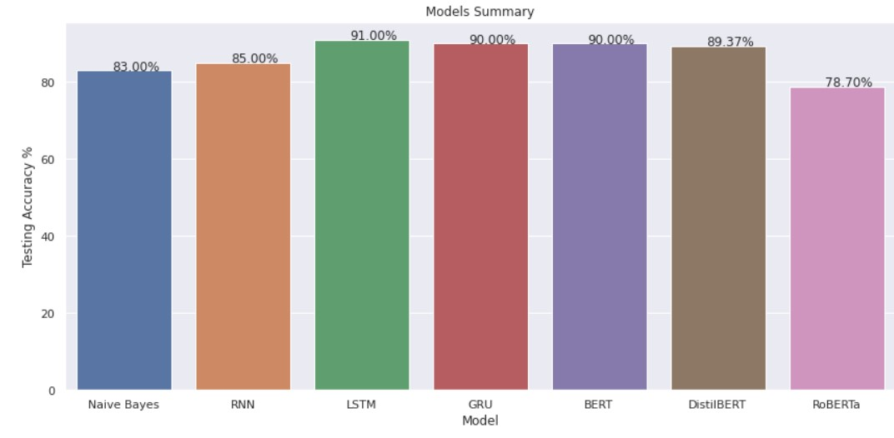

# Akhbarona-News-Classification
Text Classfication Project on an Arabic News Dataset "Akhbarona" from Single-Label Arabic News Articles Dataset for Automatic Text Categorization (SANAD)

## Description
[SANAD Dataset](https://data.mendeley.com/datasets/57zpx667y9/2) is a large collection of Arabic news articles that can be used in different Arabic NLP tasks such as Text Classification and Word Embedding. The articles were collected using Python scripts written specifically for three popular news websites: AlKhaleej, AlArabiya and Akhbarona.

## My Work
In this notebook I did Financial Sentiment Analysis by using different models
- First, Classification Models: Naive Bayes Classification Model
- Then, Sequential Models: RNN, LSTM, GRU
- Finally, Transformers: BERT, RoBERTa, DistilBERT

### Steps:
I. Generating Data: Reading data from xls file, then take around 6000 news from each category to create a balanced data (generate_data.ipynb)

II. Reading Data: using pandas

II. Preprocessing Data: using re, nltk , arabicstopwords packages for removing punctuations, references and hashtags, special characters, and multiple spaces

III. Classifier Model: using **CountVectorizer** class from sickit-learn package to convert word2vec, then split data into train and test, next fit the **Naive Bayes** model with data, and finally Evaluate the Model

IV. Sequential Model: I used 3 differnet sequential models such as **RNN**, **LSTM**, and **GRU**

VI. Transformers: I used **ktrain**, and **Hugging Face** packages to build **BERT**, **RoBERTa**, and **DistilBERT**, 

## Results

As shown, BERT, GRU and LSTM got the highest accuracy score on Test Data

